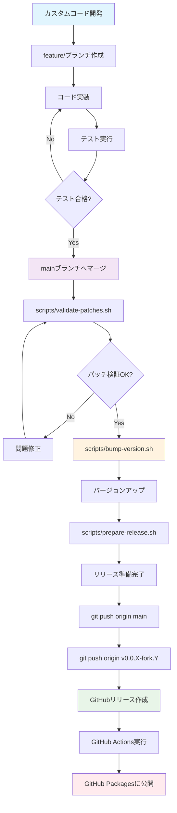

# Playwright MCP フォーク管理ガイド

このドキュメントは、Microsoft Playwright MCP のフォークを管理するための包括的なガイドです。

## 概要

このフォークは、上流ベースのバージョニング戦略（`X.Y.Z-fork.N`）を使用して、Microsoft のオリジナルリポジトリとの同期を維持しながら、独自の機能を追加しています。

### リポジトリ情報
- **フォーク元**: [microsoft/playwright-mcp](https://github.com/microsoft/playwright-mcp)
- **現在のバージョン**: `0.0.30-fork.X`
- **パッケージ名**: `@sotayamashita/playwright-mcp`

## ブランチ戦略

```
upstream      # クリーンな上流同期ブランチ
main          # カスタムパッチを含む開発ブランチ
feature/*     # 機能開発ブランチ
hotfix/*      # 緊急修正ブランチ
release/*     # リリース準備ブランチ
```

## セットアップ

### 初期設定

```bash
# リポジトリのクローン
git clone https://github.com/sotayamashita/playwright-mcp.git
cd playwright-mcp
npm install

# 上流リモートの追加
git remote add upstream https://github.com/microsoft/playwright-mcp.git

# 自動化スクリプトのセットアップ
mkdir -p scripts
chmod +x scripts/*.sh
```

## バージョニング戦略

### バージョン形式

```
X.Y.Z-fork.N
```

- `X.Y.Z` = 上流バージョン（例：0.0.31）
- `fork` = フォークを示す固定識別子
- `N` = フォークのインクリメント番号

### バージョン例

**シナリオ1: 上流の更新のみ**
```
上流: 0.0.30 → 0.0.31
フォーク: 0.0.30-fork.3 → 0.0.31-fork.1
```

**シナリオ2: カスタムパッチの追加**
```
現在: 0.0.31-fork.1
新機能: 0.0.31-fork.2
バグ修正: 0.0.31-fork.3
```

## 上流同期プロセス

### 定期的な同期

```bash
# 1. 上流の変更を取得
git fetch upstream
git checkout upstream
git merge upstream/main

# 2. リリースブランチの作成
git checkout -b release/0.0.31-fork.1

# 3. カスタムパッチのリベース
git checkout main
git rebase upstream

# 4. コンフリクトの解決（必要な場合）
git add .
git rebase --continue

# 5. テストの実行
npm test
npm run lint

# 6. バージョンの更新
npm version 0.0.31-fork.1 --no-git-tag-version
```

### 緊急時の同期

セキュリティ修正などの緊急パッチの場合：

```bash
# ホットフィックスブランチの作成
git checkout -b hotfix/security-fix-0.0.31-fork.2

# 特定のコミットをチェリーピック
git cherry-pick <upstream-commit-hash>

# テストとリリース
npm test
npm version 0.0.31-fork.2
```

## カスタムパッチ管理

### パッチの分類

1. **機能パッチ**: 新機能の追加
2. **バグ修正パッチ**: 問題の修正
3. **設定パッチ**: 環境固有の変更
4. **統合パッチ**: より良い統合のための変更

### パッチ管理のベストプラクティス

- パッチは小さく保つ
- 明確なコミットメッセージを使用
- 十分なテストを含める
- ドキュメントを更新する

### パッチファイルの作成

```bash
# パッチファイルの作成
mkdir patches
git format-patch upstream --output-directory patches/

# パッチの適用
git am patches/*.patch
```

## 自動化スクリプト

### 利用可能なスクリプト

1. **sync-upstream.sh** - 上流との同期
   ```bash
   scripts/sync-upstream.sh
   ```

2. **bump-version.sh** - バージョンのインクリメント
   ```bash
   scripts/bump-version.sh
   ```

3. **validate-patches.sh** - パッチの検証
   ```bash
   scripts/validate-patches.sh
   ```

4. **prepare-release.sh** - リリースの準備
   ```bash
   scripts/prepare-release.sh
   ```

5. **npm run test** - 包括的なテスト
   ```bash
   npm run test
   ```

## リリースプロセス

### リリース前チェックリスト

- [ ] すべてのテストが合格: `npm test`
- [ ] リンティングが合格: `npm run lint`
- [ ] ビルドが成功: `npm run build`
- [ ] カスタム機能が期待通りに動作
- [ ] パブリックAPIに破壊的変更がない
- [ ] バージョン番号が正しく更新されている

### リリースとパブリッシュ

```bash
# Git タグの作成とプッシュ
git tag v0.0.31-fork.1
git push origin v0.0.31-fork.1

# GitHub でリリースを作成
# リリースを作成すると、.github/workflows/publish.yml が自動的に実行され、
# GitHub Packages に npm パッケージが公開されます
```

## メンテナンススケジュール

### 週次タスク
- 上流の更新をチェック
- カスタムパッチのコンフリクトをレビュー
- 包括的なテストスイートの実行

### 月次タスク
- 利用可能な場合は上流と同期
- パッチドキュメントのレビュー
- 依存関係のバージョン更新
- 自動化スクリプトのレビューと更新

### リリース前
- フルテストスイートの実行
- すべてのパッチの検証
- 変更履歴の更新
- Git タグの作成
- npm レジストリへのパブリッシュ

## トラブルシューティング

### よくある問題

**上流同期のコンフリクト**
```bash
# コンフリクトの確認
git status

# ファイルを編集してコンフリクトを解決
git add .
git rebase --continue
```

**バージョン形式エラー**
- バージョン形式を検証: `X.Y.Z-fork.N`
- 提供されたスクリプトを使用

**テストの失敗**
- 上流のAPI変更を確認
- カスタムテストを更新
- カスタム機能の動作を検証

## ベストプラクティス

### バージョン管理
- ✅ 常に上流ベースのバージョニングを使用
- ✅ 新しい上流バージョンでフォーク番号をリセット
- ✅ すべてのバージョン変更をドキュメント化
- ✅ バージョンバンプ前に徹底的にテスト

### パッチ管理
- ✅ パッチは小さく、焦点を絞る
- ✅ パッチの目的と影響をドキュメント化
- ✅ 上流同期後にパッチをテスト
- ✅ 上流への貢献を検討

### 自動化
- ✅ 一貫性のために提供されたスクリプトを使用
- ✅ 本番使用前にスクリプトをテスト
- ✅ プロジェクトの変更に合わせてスクリプトを更新
- ✅ スクリプト出力を慎重にレビュー

## 開発からリリースまでの流れ

### フローチャート



### 開発フロー（詳細）

#### 1. カスタムコード開発
- [ ] **feature/ブランチ作成**
  ```bash
  git checkout -b feature/new-functionality
  ```

- [ ] **コード実装**
  - 新機能またはバグ修正を実装
  - TypeScriptで型安全なコード作成
  - ESLintルールに準拠

- [ ] **テスト追加**
  ```bash
  # テストファイル作成
  touch tests/new-functionality.spec.ts
  
  # テスト実行
  npm test
  npm run lint
  ```

#### 2. mainブランチへの統合
- [ ] **プルリクエスト作成**
  ```bash
  git push origin feature/new-functionality
  # GitHub上でPRを作成
  ```

- [ ] **レビューとマージ**
  - コードレビュー実施
  - CIチェック通過確認
  - mainブランチへマージ

#### 3. パッチ検証
- [ ] **パッチ検証実行**
  ```bash
  scripts/validate-patches.sh
  ```

- [ ] **競合チェック**
  - 上流との競合可能性確認
  - リスクの高い変更の特定

#### 4. バージョン管理
- [ ] **バージョンインクリメント**
  ```bash
  scripts/bump-version.sh
  ```

- [ ] **バージョン確認**
  - `package.json`のバージョン更新確認
  - フォーク番号の正しいインクリメント

#### 5. リリース準備
- [ ] **リリース準備実行**
  ```bash
  scripts/prepare-release.sh
  ```

- [ ] **チェック項目**
  - 全テスト合格
  - リンティング合格
  - ビルド成功
  - CHANGELOG.md更新
  - Gitタグ作成

#### 6. GitHub公開
- [ ] **変更をプッシュ**
  ```bash
  git push origin main
  git push origin v0.0.X-fork.Y
  ```

- [ ] **GitHubリリース作成**
  - GitHub上でリリースページを作成
  - リリースノートを追加
  - タグを選択して公開

#### 7. 自動公開
- [ ] **GitHub Actions実行**
  - `.github/workflows/publish.yml`が自動実行
  - テスト・ビルド・リンティングを再実行

- [ ] **パッケージ公開**
  - GitHub Packagesに自動公開
  - npm provenance付きで公開

### 便利なコマンド

```bash
# 一括実行用エイリアス
alias fork-validate="scripts/validate-patches.sh"
alias fork-bump="scripts/bump-version.sh"
alias fork-release="scripts/prepare-release.sh"
alias fork-test="scripts/test-all.sh"

# 開発フロー例
git checkout -b feature/new-assert-tool
# コード実装...
npm test && npm run lint
git add . && git commit -m "feat: add new assert tool"
git push origin feature/new-assert-tool
# PRを作成してマージ後...
fork-validate && fork-bump && fork-release
```

### トラブルシューティング

**よくある問題と解決方法:**

1. **テストが失敗する場合**
   ```bash
   # ブラウザドライバーを更新
   npx playwright install
   
   # 特定のブラウザのみテスト
   npm run ctest  # Chrome
   npm run ftest  # Firefox
   ```

2. **リンティングエラー**
   ```bash
   # 自動修正
   npm run lint -- --fix
   ```

3. **バージョン形式エラー**
   ```bash
   # 手動でバージョンを修正
   npm version 0.0.X-fork.Y --no-git-tag-version
   ```

4. **GitHub Actions失敗**
   - シークレットトークンの確認
   - 権限設定の確認
   - ワークフローログの確認

---

*このドキュメントはコードベースと共に管理されています。フォーク管理戦略に変更があった場合は、必ず更新してください。*